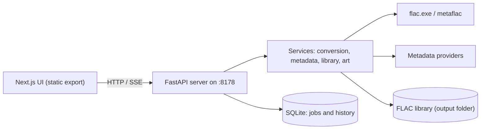
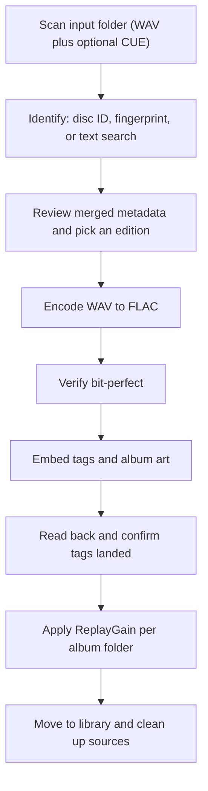
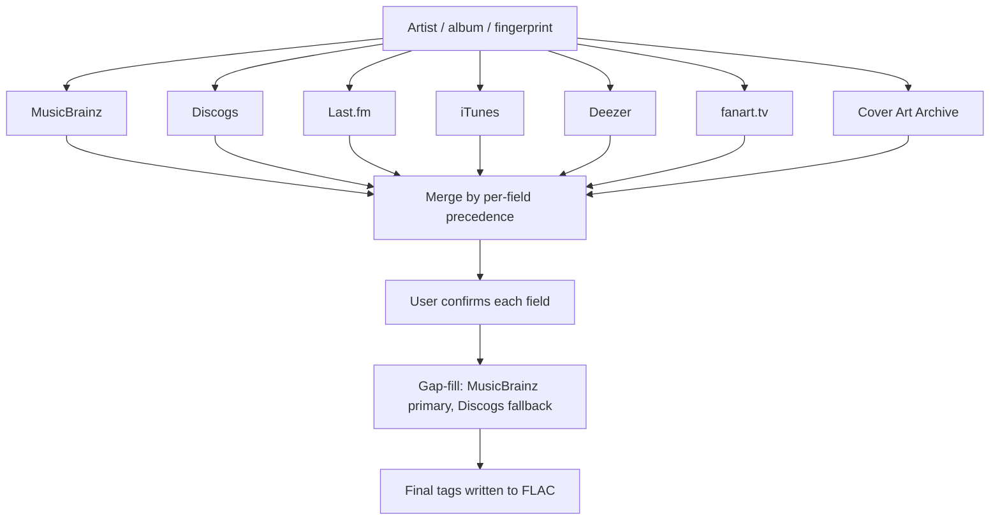
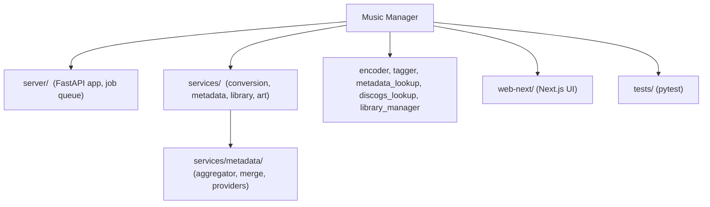

# Music Manager

Convert WAV rips into perfectly tagged, bit-perfect FLAC — with metadata pulled and reconciled from many sources, album art, ReplayGain, and a built-in library manager.


---

## Overview

Music Manager takes a folder of WAV files (optionally with an EAC-style CUE sheet), identifies the release, lets you review and choose the metadata, then encodes verified lossless FLAC into an organized library. It runs as a local FastAPI server with a Next.js front end that opens in a desktop app window.

At its core the app does four things well:

- **Lossless conversion** — WAV to FLAC via the reference encoder, with a bit-perfect verify pass and a read-back confirmation before anything is considered done.
- **Multi-source metadata** — eight providers are queried and merged field by field, so you are not at the mercy of any single database.
- **Artwork and loudness** — cover art is compared across sources and the highest resolution wins; ReplayGain tags are computed without ever touching the audio.
- **Library management** — scan, score completeness, detect compilations and duplicates, re-tag, and reorganize an existing FLAC library.

## Key features

- WAV to FLAC encoding with selectable compression and a bit-perfect verification pass.
- Release identification by MusicBrainz disc ID, AcoustID audio fingerprint, barcode, or text search.
- Per-field metadata aggregation across MusicBrainz, Discogs, Last.fm, iTunes, Deezer, fanart.tv, AcoustID, and Cover Art Archive, with user-confirmable choices.
- Edition picker with country, media-type, and track-count filters.
- Cross-provider gap-fill: MusicBrainz primary, Discogs fills what it lacks (album fields and per-track lengths).
- Performer and writer credits (composer, lyricist, conductor, performers) from MusicBrainz relationships.
- Album art selection across providers plus local folder art, with rescale and missing-art reporting.
- ReplayGain (track and album) computed per folder; tags only, audio untouched.
- Library view with completeness scoring, compilation detection, duplicate detection, Quick Clean Up, and an advanced raw-tag editor.
- Persistent job queue with live progress over server-sent events.

## Architecture



## How conversion works



The cleanup step (deleting source WAV and CUE) only runs when every track converted and verified successfully, so a partial or failed run never destroys originals.

## Metadata aggregation



Each provider contributes the data it is good at. Album-level descriptive fields and artwork are merged across all enabled providers; track lengths fill MusicBrainz to Discogs; performer credits and ISRC come from MusicBrainz.

| Provider | Supplies | API key |
| --- | --- | --- |
| MusicBrainz | Identity, tracklist, ISRC, credits, genre (tags), core fields | Not required |
| Cover Art Archive | Cover art keyed by MusicBrainz release | Not required |
| Discogs | Genre and styles, label, catalog, barcode, art, tracklist | Required |
| Last.fm | Genre and tags | Required |
| AcoustID | Audio fingerprint identification | Required, plus fpcalc |
| fanart.tv | High-quality cover art | Required |
| iTunes | Core fields, cover art | Not required |
| Deezer | Core fields, cover art | Not required |

## Install from a release

Each tagged release ships a zip with the front end already built, so you do not need Node to run it:

1. Download `wav2flac_metatagger-<version>.zip` from the [Releases page](https://github.com/louissilvestri/wav2flac_metatagger/releases) and extract it.
2. Install the Python dependencies and the FLAC tools (see Prerequisites below).
3. Run `python -m server --open` (or `run.bat` on Windows).

To work on the code instead, build from source as described next.

## Getting started

### Prerequisites

- Python 3.12 or newer
- Node.js 18 or newer
- FLAC command-line tools (`flac` and `metaflac`); ReplayGain needs `metaflac`
- Optional: `fpcalc` (Chromaprint) for AcoustID fingerprinting
- Primarily developed and tested on Windows

### Install

```bash
# Backend
python -m venv venv
venv\Scripts\activate            # on Windows
pip install -r requirements.txt

# Front end (produces web-next/out, which the server serves)
cd web-next
npm install
npm run build
cd ..
```

### Configure API keys

Keys are optional but unlock more providers. You can enter them in the app under Settings, or copy the template and edit it:

```bash
cp .env.example .env
```

A provider whose required key is missing is simply skipped.

### Run

```bash
python -m server --open
```

The server starts on `http://127.0.0.1:8178` and `--open` launches the UI in a desktop app window. If an older instance is already running on the port, it is replaced automatically. On Windows you can also use `run.bat`.

## Configuration

Settings live in the app UI and persist to a per-user config directory. Notable options:

- Default input and output folders, FLAC encoder path, and compression level.
- Verify encoding (bit-perfect guarantee).
- Calculate ReplayGain (loudness) tags.
- Fetch performer credits (composer, conductor, and so on).
- Fill missing fields from Discogs when MusicBrainz lacks them.
- Album art embedding, maximum size, and quality.

## Testing

```bash
python -m pytest tests/
```

The suite covers tagging, metadata merge and aggregation, cross-provider backfill, track merging, path building, ReplayGain presence, and the API surface.

## Project structure



## Status and notes

Version 2.0.0. ReplayGain and all tagging operations are non-destructive to the audio stream: a FLAC's decoded-audio MD5 is unchanged after tagging, and the encoder verifies losslessness against the source WAV.

## License

Released under the [MIT License](LICENSE).
